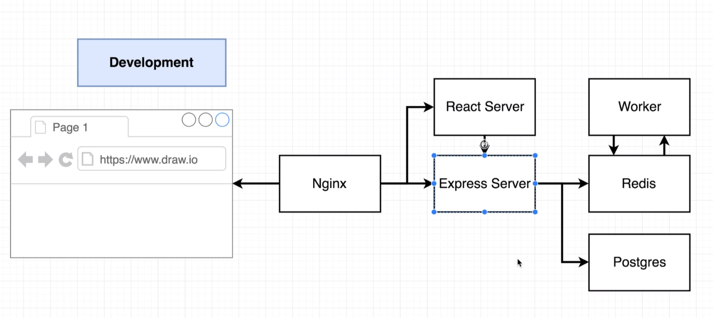
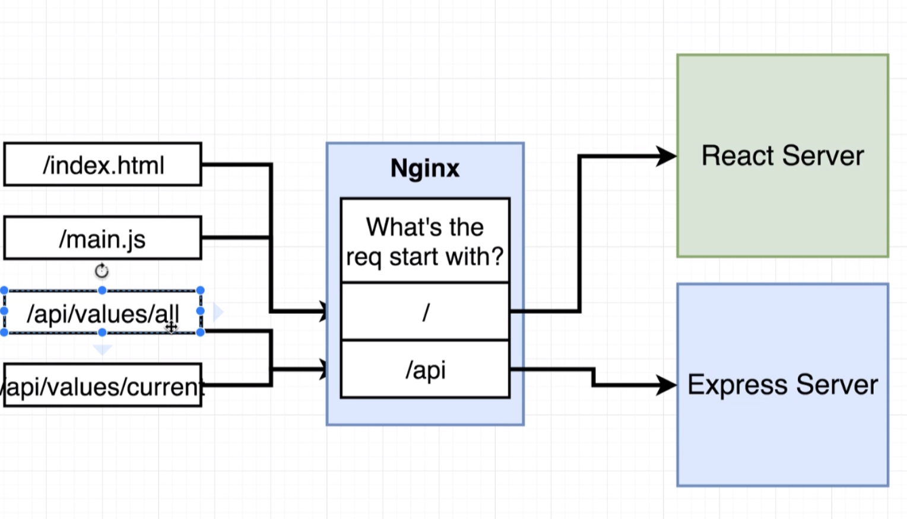

## multi container docker deployment example

[From the docker-kubernetes Udemy course](https://www.udemy.com/docker-and-kubernetes-the-complete-guide)

- unlike the previous project, which used nginx to host react files in a production environment, this project is using nginx in the development environment
  - routes requests between react & express (`/api`) servers
    - if we just made use of different ports, it would behave differently than the production environment

