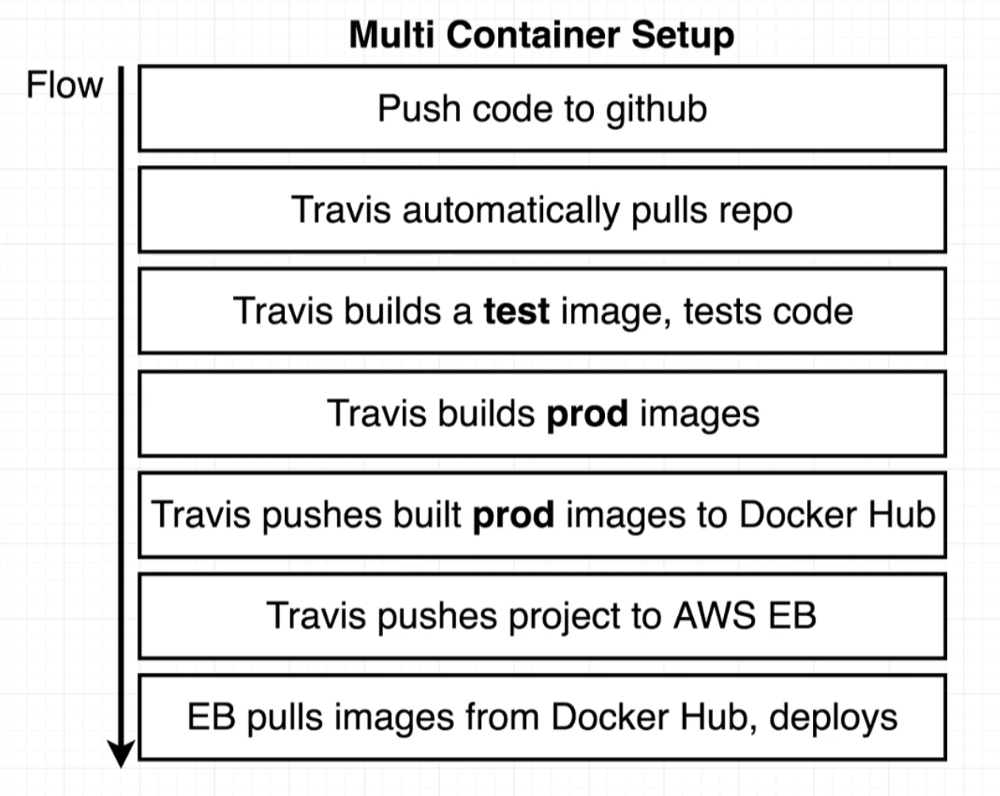
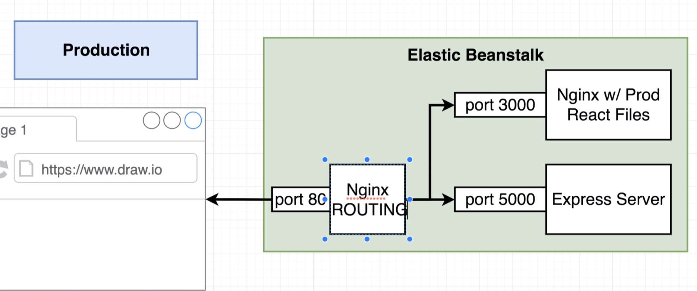
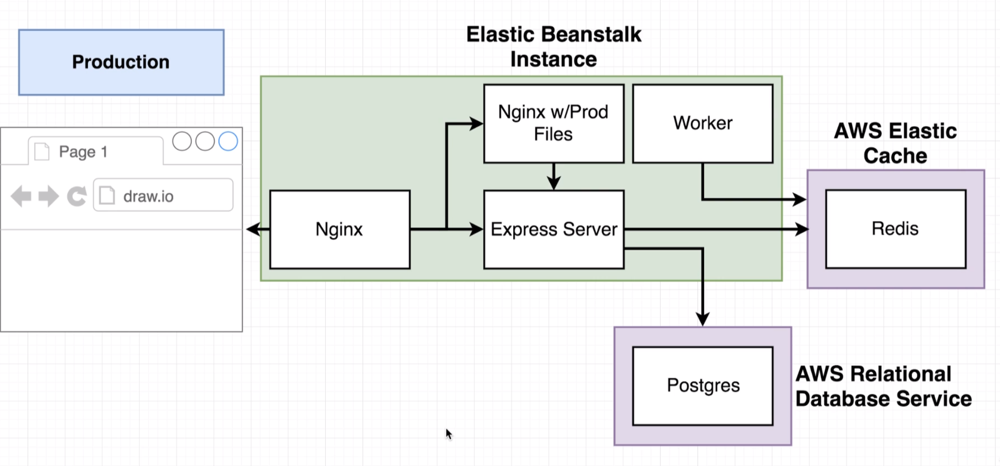

## multi container docker deployment example

[From the docker-kubernetes Udemy course](https://www.udemy.com/docker-and-kubernetes-the-complete-guide)

- unlike the previous project, which used nginx to host react files in a production environment, this project is using nginx in the development environment
  - routes requests between react & express (`/api`) servers
    - if we just made use of different ports, it would behave differently than the production environment

## The production config uses two nginx servers - 1 for routing & 1 for serving React's prod files

## on AWS, we use RDS & Elastic Cache (instead of Postgres & Redis containers)

## AWS Configuration cheat sheet

Stephen has a cheat sheet [here](https://www.udemy.com/course/docker-and-kubernetes-the-complete-guide/learn/lecture/21321244#notes) for running through the necessary AWS config steps
